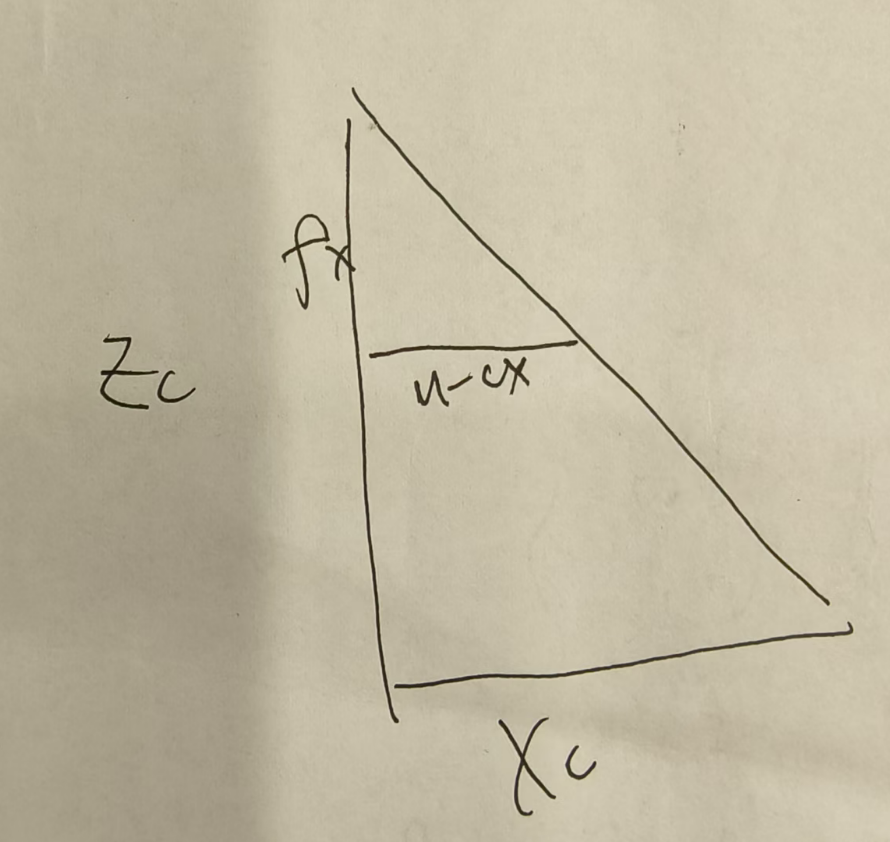

---
puppeteer:
    timeout: 3000
---

# A题解题思路

出题者将A题分成了两个部分。

子问题1是根据相机内外参、坐标系定义，恢复出场地平面上的点在机器人世界坐标系中的坐标，这是题目的核心

子问题2是对图片中的中心圆、白线进行检测，这边因为没有提供数据集，我就不去具体训练了，仅提供思路，口胡出答案。

## 子问题1

这道题其实非常清晰，我给他分成两部分。

首先说明，子问题1其实就是，把像素坐标系中的坐标转化成机器人世界坐标系中的坐标，这中间有一个过渡，就是相机坐标系。

那么具体怎么变换呢？

### 像素坐标系转换成相机坐标系
首先像素坐标系转换成相机坐标系，就是所谓的内参。这怎么转化呢？上过小学二年级的同学都知道针孔模型，上过初中二年级的同学都知道针孔模型用相似三角形秒了。（btw，这道题有个错误，伟大的出题学长给的内参是cx,cy,fx,fy,言下之意也就是说主光轴是z轴，可是好巧不巧，伟大出题学长还给了相机坐标系，如果z轴是主光轴，那么我们的小机器人正在斜四十五度仰望天空，这是不可能定位的）

所以这道题不可能算出个代数结果。没关系，我们分析分析就好了。

那我们继续分析，一图胜千言（我们把z坐标轴当成主光轴）：

!

ok，同理Y_c也可以这么算出来。

我们有

$$
\begin{cases}
    \begin{split} 
    \frac{X_c}{Z_c} = \frac{u-c_x}{f_x}
    \end{split}
    \\
    \begin{split}
    \frac{Y_c}{Z_c} = \frac{v-c_y}{f_y}
    \end{split}
\end{cases}
$$

当然，如果你线性代数学的比较好，你也可以这么算

$$
\begin{bmatrix}
u\\
v\\
1
\end{bmatrix} = \frac{K}{Z_c}\begin{bmatrix}X_c \\ Y_c \\ Z_c \end{bmatrix}
$$

此时
$$
K = \begin{bmatrix} f_x & 0 & c_x \\ 0 & f_y & c_y \\ 0 & 0 & 1\end{bmatrix}
$$

但我们别忘了我们这边是在干什么？我们是在把像素坐标系转化为相机坐标系。实际上真的能转化吗？我们给定u v能得到Z_c Y_c X_c吗？显然不行，那怎么办呢？我们接着往下看。

### 相机坐标系转换成机器人世界坐标系

这边就很简单了，学过机器人学1就秒了，其实所谓什么外参矩阵，不就是个T吗，姿态变换矩阵。我决定使用机器人学中的符号，这样比较清晰。

$$
\left[\begin{array}{c}
^cP \\1
\end{array}\right]

= \left[\begin{array}{c}
^c_wR & ^cO_w\\
0&1
\end{array}\right]

\left[\begin{array}{c}
^wP \\ 1
\end{array}\right]
$$

写在字母左上角的表示参考坐标系

$$^c_wR$$ 
表示w坐标系相对c坐标系的转化

btw，本文所叙述的c表示camera，w表示world

### 回到之前的问题

我们给出(u,v)并不能得到x_c,y_c,z_c，那我们岂不是变换断掉了吗？

其实不是的，p_c到p_w是一一对应的，然后我们又知道我们拍到的坐标都是在地上的，就是Z_w等于0，那么我们不就引入了一个等量关系嘛，那之前多的一个自由度不就被消掉了吗，秒了。

## 子问题2

传统方法有用霍夫变换的，深度学习这边可以用yolov8模型，具体不展开，没给数据集，我也不可能去自己拍，自己标注。

## 我们的问题到此为止了吗

当然不是，我们还没解决我们的关键问题呢，定位。

定位怎么做？我们之前说到底，也只是做了个坐标转换，如果从代数的角度去思考问题，想要实现定位，就必须去找别的条件。什么条件？我们有已知点。

子问题2中给我们标出来中心点、直线和圆交点等特殊点，而且它们在世界坐标系中（区别于机器人坐标系）的坐标是我们可以事先知道的。有了先验信息，我们引入了pnp算法，它描述了当我们知道n个3D空间点（世界坐标系）以及它们的投影位置时，如何估计相机的姿态。

当然，我们可以想见，我们有三个自由度（两个平动一个转动，那么我们要三个点，这也是为啥我们子问题2要识别几个点出来）