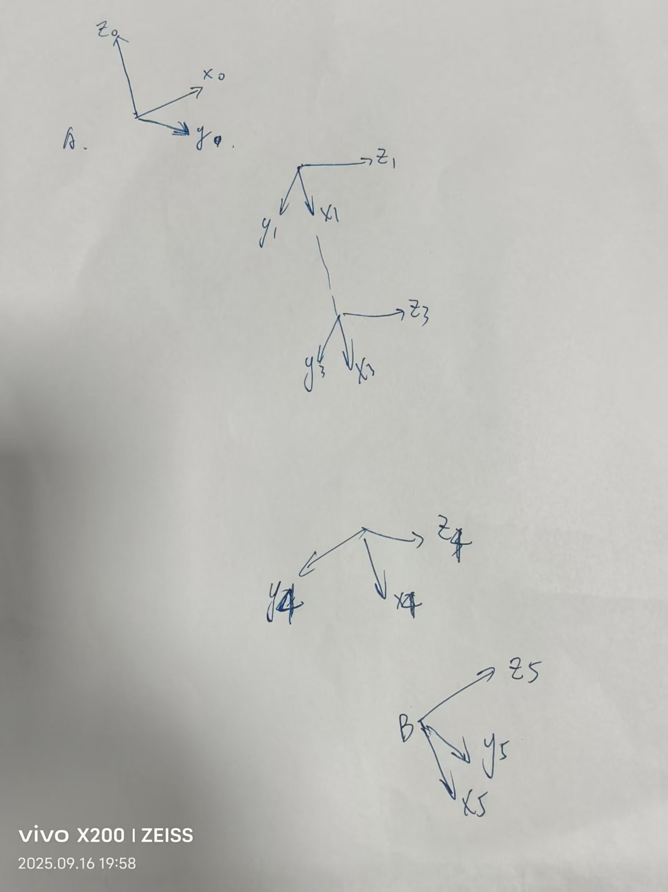
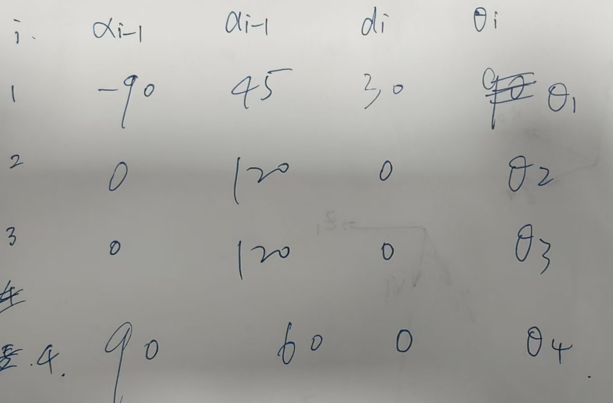
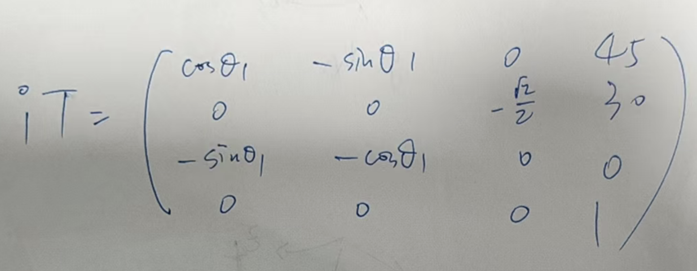

# B题解答

这是经典的机器人学的知识，思路上没难度，计算上很繁琐。

## B-1

### B-1（1）

一个改进DH参数法

图画的有点抽象，给个dh表吧

（哦，画错了，3是2，4是3，依次类推）

dh出来了，那正运动学还远吗？

代个公式吧（

给第一个 

剩下的几个略。

### B-1（2）

典型的一个逆运动学的题目，这是个4自由度的机器人，把前面的正运动学写出来，然后代坐标和姿态，解方程就好了。当然也有几何解，你要是能解出来，那也真是厉害。

哦对了，如果没解析解，就用数值解法呗，随便找个编程语言都有，matlab的robotic tool box也有，不过这题这么正交，99%有解析解。

## B-2

这题有意思，比第一问有意思。

### B-2-1

约定，我们用P代指点坐标，那么根据质心定义，我们有

$$
\frac{m_1P_{A_1}+m_2P_{A_2}+m_3P_{T}}{3}=mP_C\\ \\ P_T=\frac{3mP_C-m_1P_{A_1}-m_2P_{A_2}}{m_3}
$$

### B-2-2

提示足够明显

V可以认为是角A1TA2平分线的相反向量

$$
\vec V=-\frac{\vec {TA_1}+\vec {TA_2}}{2}
$$

第一问代入，得到
$$
\vec V=\frac{(m_3+2m_1)P_{A_1}+(m_3+2m_2)P_{A_2}-6mP_c}{2m_3}
$$

### B-2-3

第二问铺垫的很好啊

第二问给出了v变换后的向量，而之前的向量就是竖直向上的，那看这个怎么变得不就秒了吗

我们这样子算，设pitch角为$$\theta 1$$

roll 角为
$$\theta 2$$

那么我们有

$$
\begin{bmatrix}
0\\0\\1
\end{bmatrix}
\begin{bmatrix}
c\theta 1 & 0 & s\theta1\\
0 & 1 & 0\\
-s\theta1 & 0 & c\theta1
\end{bmatrix}
\begin{bmatrix}
1 & 0 & 0 \\
0 & c\theta2 & -s\theta2\\
0 & s\theta2 & c\theta2
\end{bmatrix}
=\vec P 
$$

当然要做个归一化处理

### B-2-4

$$
\begin{bmatrix}^TP_M \\ 1\end{bmatrix} = \begin{bmatrix}^T_{A_1}R & ^TP_{A_1}\\0&1\end{bmatrix}\begin{bmatrix}^{A_1}P_M \\ 1\end{bmatrix}
$$

后面代一下吧，没给啥原始数据，这计算也太逆天了，肯定会有几个未知量，把给的yaw角用起来应该就能解决了。

### B-2-5

同理

----

补充，看错了，看漏掉两个自由度，但是方法应该差不多。实在抱歉！